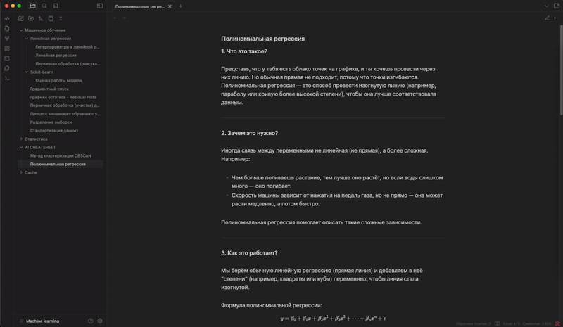

# Cheatsheet Generator Plugin

Этот плагин для Obsidian позволяет генерировать шпаргалки на основе заданной темы, используя Python-скрипт.

## Пример использования



## Установка

{NAME_YOUR_OBSIDIAN_VALUT} - имя вашего OBSIDIAN хранилища

1. Скопируйте папку плагина в директорию плагинов Obsidian:

   ```
   /{NAME_YOUR_OBSIDIAN_VALUT}/.obsidian/plugins/extension_ai_obsidian
   ```

2. Убедитесь, что у вас установлен Python и необходимые зависимости. Вы можете создать виртуальное окружение и установить зависимости с помощью:

   ```bash
   cd "/{NAME_YOUR_OBSIDIAN_VALUT}/.obsidian/plugins/extension_ai_obsidian"
   python3 -m venv .venv
   source .venv/bin/activate
   pip install -r requirements.txt
   ```
3. Создайте .env файл в корне проекта:
``` python
# Путь до папки AI CHEATSHEET
OBSIDIAN_VAULT_PATH=.../NAME_YOUR_OBSIDIAN_VALUT/AI CHEATSHEET

# LLM API TOKEN. Нужно использовать https://openrouter.ai/
LLM_API_KEY=
```

4. Создайте директорию в вашем Obsidian хранилище под названием "AI CHEATSHEET"
5. Перейдите в Найстройки -> Сочетание клавиш -> Cheatsheet Generator: Generate Cheatsheet и назначьте сочетание клавиш.

## Использование

1. После установки плагина перезапустите Obsidian.
2. Нажмите сочетание клавиш, которые ранее назначили.
3. Введите тему для вашей шпаргалки и нажмите кнопку "Generate".
4. После генерации шпаргалки вы сможете редактировать и сохранить её.

## Функции

- Генерация шпаргалок на основе заданной темы.
- Возможность редактирования сгенерированной шпаргалки перед сохранением.

## Лицензия

Этот проект лицензирован под лицензией MIT. Подробности можно найти в файле [LICENSE](LICENSE).

## Контакты
- **Имя**: Александр Волжанин
- **Email**: alexandervolzhanin2004@gmail.com
- **GitHub**: [m4deme1ns4ne](https://github.com/m4deme1ns4ne)

